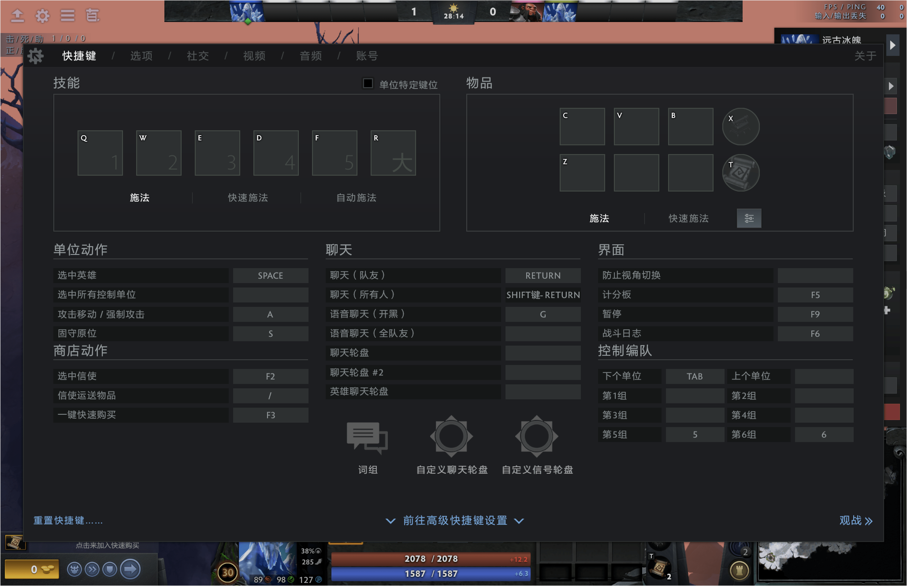
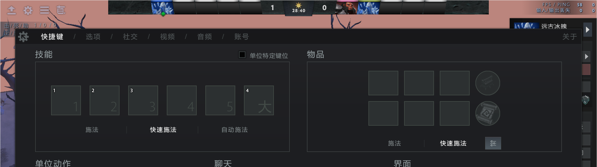
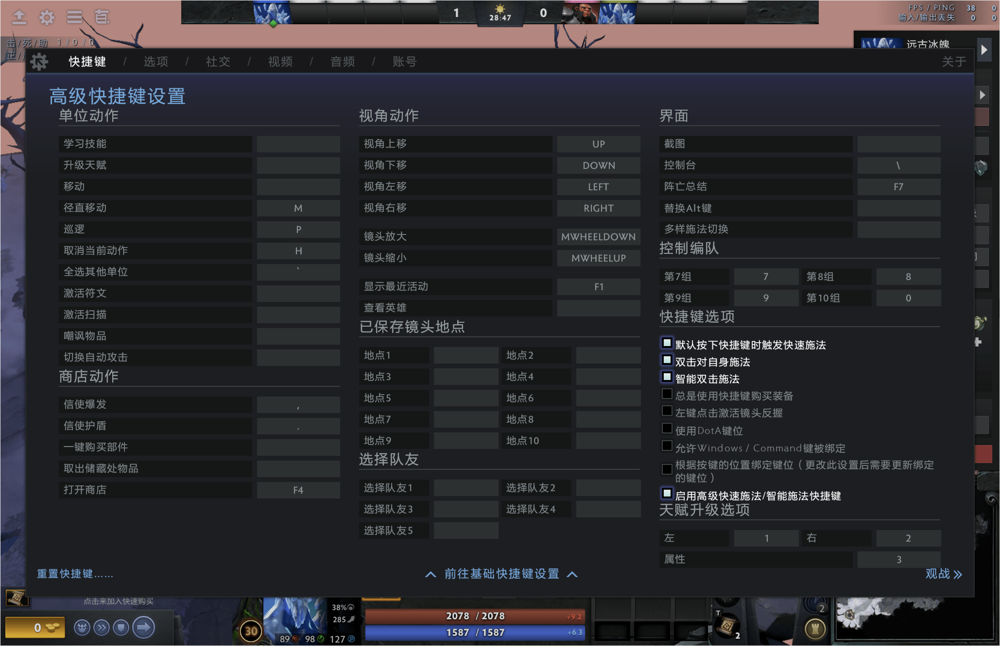
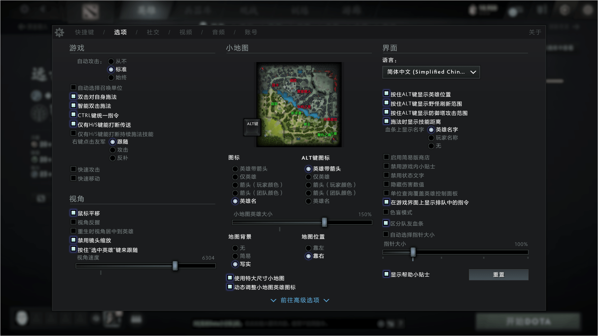
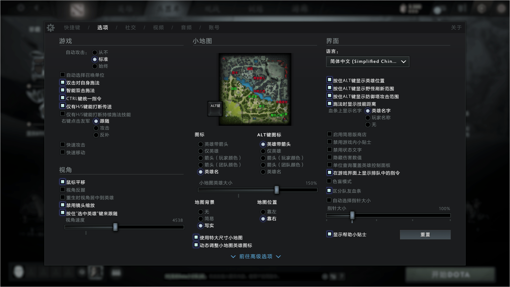
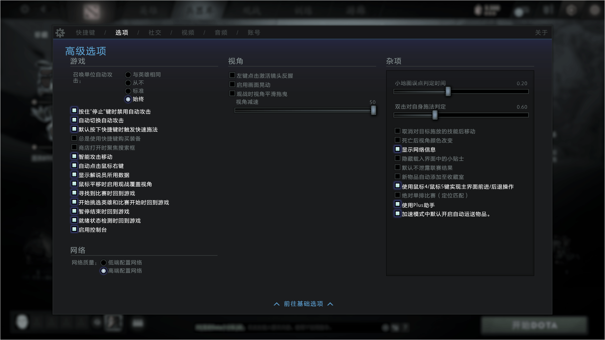
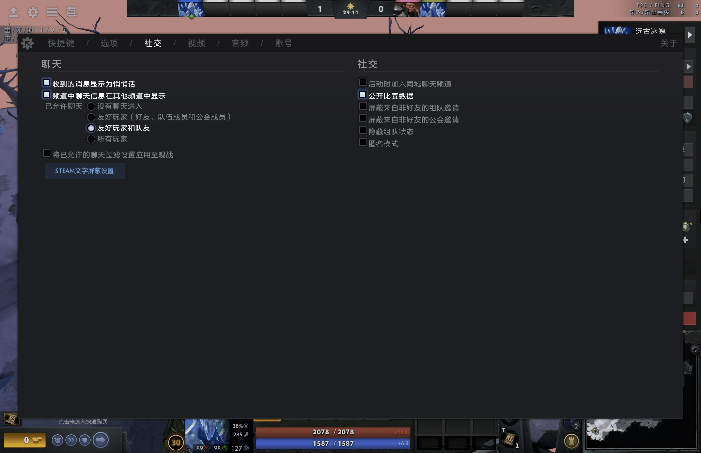
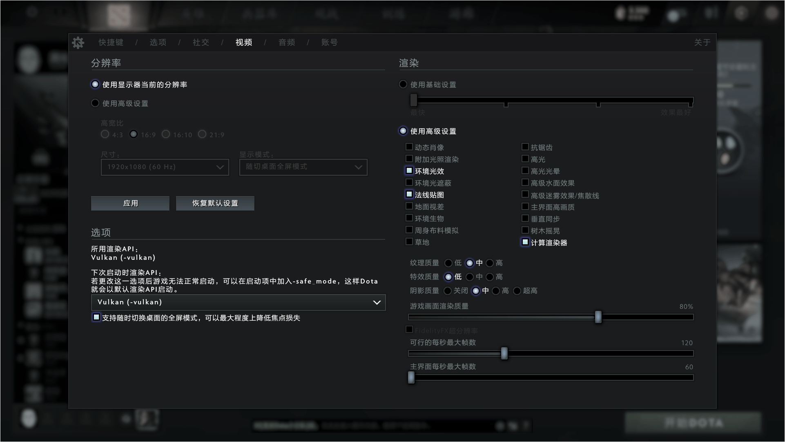
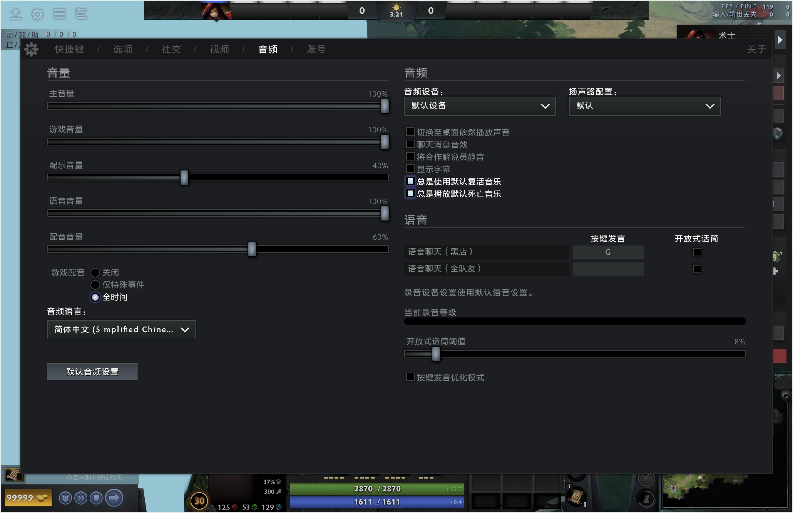

# Dota2

1. 神谕者

    1. 一技能：气运之末

        满级6秒cd，弱驱散敌人+弱驱散友军

        - 针对：

            1. 物品：

                血腥榴弹，阿托斯之棍/缚灵索，EUL的神圣法杖/风之杖，紫怨/血棘，幽魂权杖/虚灵之刃，暗影护符/微光披风，疯狂面具，净魂之刃/散魂剑，纷争面纱/希瓦的守护，雷神之锤，影之灵龛/魂之灵龛，赤红甲，韧鼓/宽容之靴，长盾/炎阳纹章，黯灭，以及一些其他影响状态、数值的装备
            2. 技能：

                1. 力量英雄：斯拉达的守卫冲刺、侵蚀雾霭，斧王的战争饥渴、淘汰之刃，斯温的战吼，潮汐猎人的巨浪、锚击，噬魂鬼的撕裂伤口、尸鬼狂怒，全能骑士的守护天使，龙骑士的火焰气息，昆卡的洪流，撼地者的强化图腾，冥魂大帝的绝冥再生，哈斯卡的心炎、牺牲，暗夜魔王的虚空、末日使者的阎刃，裂魂人的威吓，*炼金术士的狂暴药剂*，狼人的嗥叫，*树精卫士的寄生种子、活体护甲、疯狂生长*，食人魔魔法师的引燃、嗜血术、烈火护盾，*半人马战行者的反伤*，伐木机的死亡旋风，钢背兽的粘稠鼻夜，*巨牙海民的酒友、海象神拳、海象飞踢*，上古巨神的灵体游魂（神杖后无法驱散）、裂地沟壑，*军团指挥官的压倒性优势、强攻*，*大地之灵的巨石冲击、地磁之握、磁化*，孽主的火焰风暴、怨念深渊，凤凰的凤凰冲击、烈火精灵，*破晓辰星的上界重锤*，*獣的凶、突*
                2. 敏捷英雄：矮人直升机的火箭弹幕，
                3. 智力英雄：百戏大王的3个小技能，痛苦女王的暗影突袭，
                4. 全才英雄：

        >其他弱驱散一样。
1. 辅助因为出了很多非输出装，因此要注意推推不要升级为大推推，浪费金钱，也导致自己会想上去A人然后违背辅助要躲着放技能的初衷——用没有什么伤害的增加 去换取主动暴露辅助位置 去减少保命装
1. 白银之锋：破坏，被动技能无效6秒

    针对英雄：PA的闪避和暴击、刚被、潮汐、幽鬼的2被动、力丸的隐身、等
1. 否决坠饰：否决，持续弱驱散4秒

    针对道具：吹风、微光、推推

    针对英雄：NEC、经常出以上道具的辅助

>可控制角色类型：
>
>1. 「英雄级」：除了英雄之外，还包含类英雄级角色，如：英雄幻象、熊灵、酒仙大招、等。
>2. 「次英雄级」：强力召唤物，大部分是大招，如：术士地狱火、佣兽、等。
>3. 「普通召唤物」：大部分是小技能召唤物或魅惑/支配的野怪、小兵。

1. 英雄模型上血条的格子，一格250点血

    1. 小兵、塔、野怪、信使、召唤物、肉山、等模型上只有血条，没有格子
    2. 各种守卫的血条上格子表示能够承受特定几次攻击
2. 持续施法期间使用物品是否被打断？

    1. 不打断：暗影护符、微光披风
    2. 会打断：黑皇杖、幽魂权杖/虚灵刀、各种鞋、等绝大部分道具、隐刃/白银之锋、刃甲、臂章
3. 仇恨系统

    >[【Dota2】仇恨机制完全解析](https://www.bilibili.com/video/BV1s54y1A77m)、[wiki：仇恨](https://dota.huijiwiki.com/wiki/仇恨)。

    1. 吸引仇恨的范围（和射程不一致）

        1. 防御塔500
        2. 近战小兵500
        3. 远程小兵600
        4. 攻城单位800
        5. 野怪240（夜晚睡觉）
        6. 肉山140
    2. 哪些角色可以吸引仇恨、刷新仇恨

        1. 吸引仇恨（2种方式）

            1. A敌方英雄的指令：

                英雄级。
            2. 对敌方英雄开始攻击动作：

                英雄级、次英雄级。

            - 普通召唤物不能吸引仇恨。
        2. 刷新仇恨

            1. A友方单位：

                英雄级、次英雄级、普通召唤物
    3. A英雄吸引仇恨、刷新仇恨，可以无限远（敌方英雄、友方英雄均可）

        1. 可以直接A界面顶部头像（敌方英雄、友方英雄均可）
    4. 刷新仇恨（转移兵或塔的仇恨）

        1. 正在被攻击角色，A一下友方单位，会导致攻击者按优先级重新计算攻击对象（攻击优先级看上面wiki）
    5. 仇恨可变化的内置cd：3秒（A敌方英雄、A友方英雄共用一个cd）

        自下达攻击指令后开始计算。e.g. 若下达攻击指令时位于小兵的仇恨范围外，则3秒内进入小兵的攻击范围，无论下达多少次攻击指令，都不会吸引小兵仇恨。
    6. 自动施法状态下右击或者A英雄，会吸引仇恨

        1. 只有选择技能后再左击英雄施法才不会触发吸引仇恨
    7. 投石车仇恨距离800，如何保护投石车？

        1. 友方英雄不要在我方投石车仇恨范围内被任意敌方单位攻击，被攻击会导致投石车冲向攻击者，从而进入敌方单位射程，尤其是塔的射程
    - 野怪的仇恨不太一样，先只需要知道以下2点：

        1. 在1800距离内对它们造成伤害或对它们使用技能。吸引到中立生物的仇恨后，它们会遵守常规的自动攻击规则，这意味着它们优先攻击最靠近它们的敌人，而不是对他们造成伤害的敌人。
        2. 若仇恨范围内的一个英雄发出了攻击敌方英雄的指令，则该中立生物会立刻将攻击目标转换为那位发出攻击指令的英雄。
4. 设置

    
    
    
    
    
    
    
    
    
